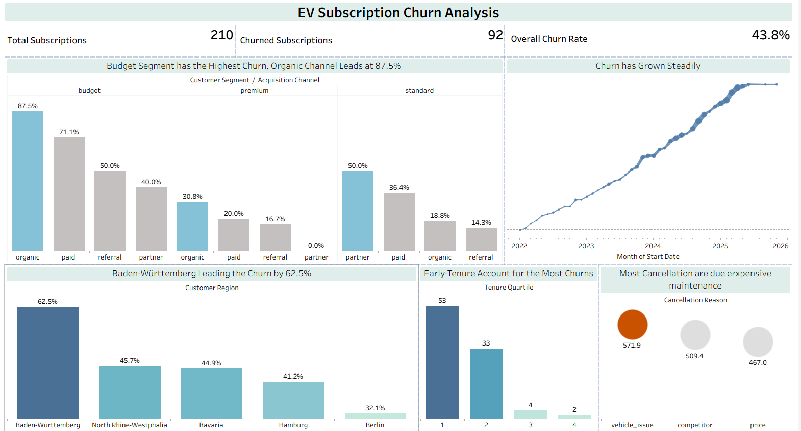
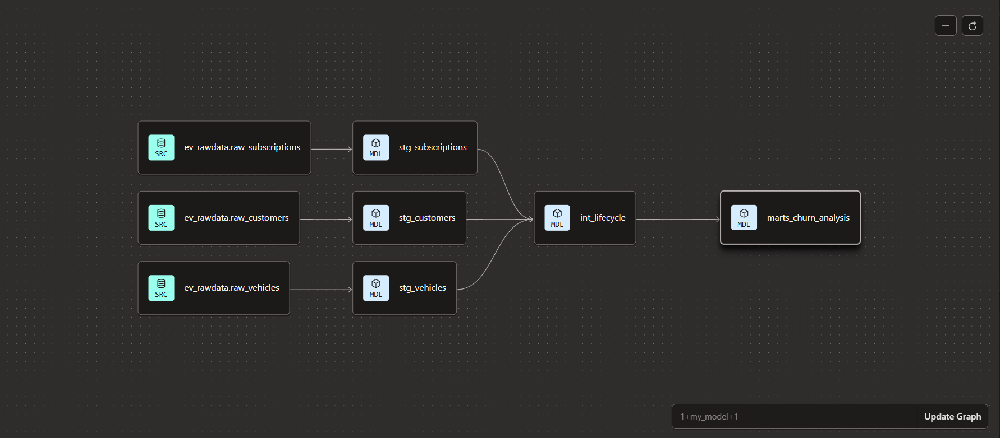

# EV Subscription Churn Analysis

> **What makes an EV subscriber cancel — and can we see it coming?**
> This project explores churn patterns across customer segments, acquisition channels, and regions for a fictional EV subscription business operating in Germany. Built end-to-end as an analytics engineering portfolio project.

---

---

## The Finding

Nearly half of all subscriptions churn — **43.8% across 210 subscriptions**. But the headline number hides a sharper story.

**Budget-segment customers who found the product organically churn at 87.5%.** These are customers who arrived without sales guidance, without expectation-setting, and without a loyalty anchor. When vehicle maintenance costs hit, they leave — and they leave fast. 90 of 92 total churns happened in the two shortest tenure quartiles combined - 57 in first quartile.

The cancellation data confirms it: customers who cited expensive vehicle maintenance as their reason had the highest average monthly fee at €571.9 — and they skew heavily toward the organic channel.

This isn't just a churn problem. It's an acquisition and onboarding problem.

---

## Dashboard

The Tableau dashboard covers five views:

- Churn rate by customer segment and acquisition channel — the conclusive chart
- Cumulative churn over time, showing steady growth from 2022 to 2026
- Churn count by tenure quartile — early drop-off is stark
- Churn rate by German region — Baden-Württemberg leads at 62.5%
- Average monthly fee by cancellation reason — the cost signal

> Dashboard not yet published to Tableau Public. Screenshots available in `/assets`.

---

## How It Was Built

This project follows a production-style analytics engineering workflow: raw source data flows through a modular dbt pipeline in BigQuery before reaching Tableau.

### The Pipeline

Three raw CSV files land in BigQuery as source tables. From there, dbt handles everything.

**Staging layer** cleans and standardises each source independently — deduplicating customer records using `ROW_NUMBER()`, casting types, and flagging nulls. Nothing is joined here. Each model owns one source and one source only.

**Intermediate layer** (`int_lifecycle`) is where the analytical logic lives. Customers, subscriptions, and vehicles are joined here. A churn flag is derived. `LAG()` tracks status changes across a customer's subscription history. This is the layer that makes the mart possible.

**Mart layer** (`marts_churn_analysis`) is a single wide table built for Tableau. It adds `NTILE(4)` to rank subscriptions into tenure quartiles globally, and `SUM() OVER()` to produce a running cumulative churn count ordered by start date. One row per subscription. No joins needed in Tableau.

| Model | Layer | Key SQL |
|---|---|---|
| `stg_customers` | Staging | `ROW_NUMBER()` deduplication |
| `stg_subscriptions` | Staging | Null handling, type casting |
| `stg_vehicles` | Staging | `DATE_DIFF()` for vehicle age |
| `int_lifecycle` | Intermediate | `LAG()`, churn flag, three-way join |
| `marts_churn_analysis` | Mart | `NTILE(4)`, `SUM() OVER()` |

### Testing & Documentation

37 dbt tests run across all layers — covering uniqueness, null constraints, accepted values, and custom SQL assertions. 36 pass. One warning: duplicate emails in staging, an intentional data quality issue baked into the source data to demonstrate real-world handling.

Every model and column is documented in `__schema.yml` files at each layer.

---

## Data Note

The source data is synthetic — generated specifically for this project. Distributions are intentionally imperfect. The findings were not pre-determined; the data was designed with realistic noise and the analysis was run honestly against it. The organic channel result at 87.5% was not the planned headline — it emerged from the data and replaced the original hypothesis.

---

## Stack

`dbt Cloud` · `Google BigQuery` · `Tableau Desktop` · `Git / GitHub` · `VS Code`

---

## About

**Bassem Sayed** — Senior Data Analyst with 10 years of experience, transitioning into analytics engineering.

[GitHub](https://github.com/bassem-msayed) · [LinkedIn](ADD_LINKEDIN_URL_HERE)
